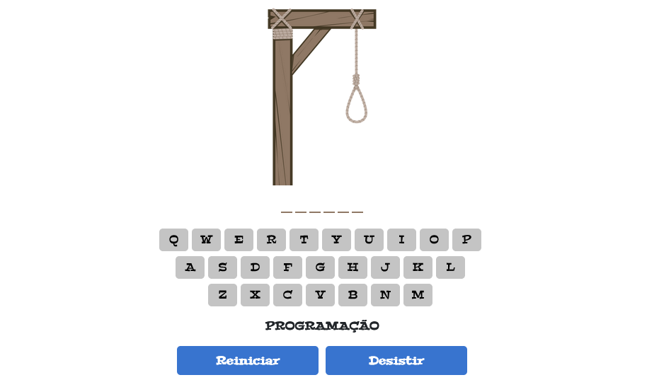
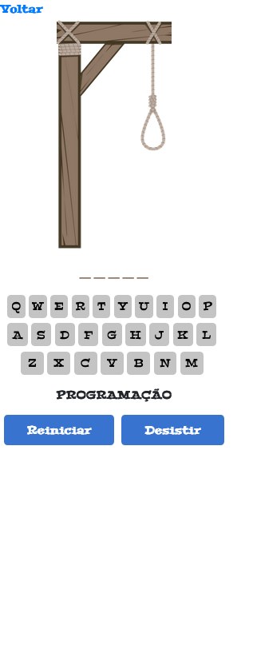

# 💻 Jogo da forca

Projeto simples do jogo da forca desenvolvido no programa oracle one como desafio da formação iniciante em programação.

**Deploy:** <a href="https://levymatias.github.io/jogo_da_forca/" target="_blank">Projeto</a>

## ⚙️ Funcionalidades

- Botão de iniciar o jogo 
- Temas relacionados com tecnologia
- As entradas das letras é clicando nos respectivos botões no teclado da página.
- Quando o jogador errar uma letra ela ficará vermelha
- Quando o jogador acertar uma letra ela ficará verde
- Quando o jogador acerta a palavra abre o modal dizendo que ele acertou.
- Quando o jogador erra a palavra abre o modal dizendo qual era a palavra correta.
- Botões de reiniciar e desistir
- Responsividade
  
## 🎨 Layout

Web



Mobile 



## 🚀 Rodando localmente

Clone o projeto

```bash
  git clone https://github.com/LevyMatias/jogo_da_forca
```

Entre no diretório do projeto

```bash
  cd jogo_da_forca/
```


## 🛠️ Tecnologias utilizadas

**Front-end:** Javascript, Html, CSS

**Ferramentas:** Visual Studio Code, Git


## 🦸 Autores

- Levy Matias


[Linkedin](https://www.linkedin.com/in/levy-matias/)

